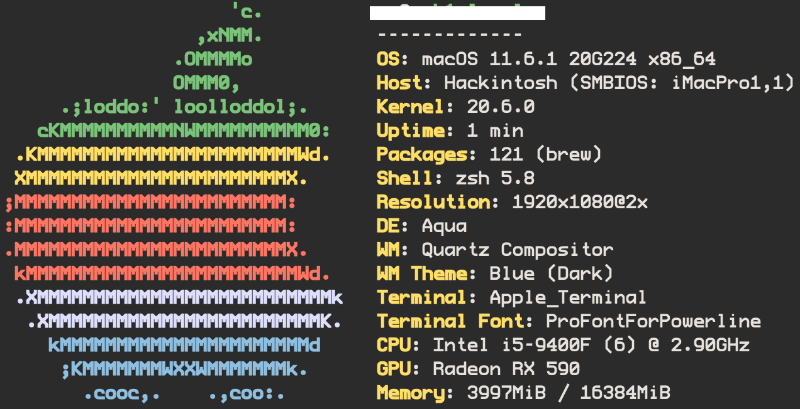

# Hackintosh OpenCore EFI
  

### 内核扩展

  | AppleALC | IntelMausi | Lilu  | NVMeFix | VirtualSMC | WhateverGreen |
  | :------: | :--------: | :---: | :-----: | :--------: | :-----------: |
  | 1.6.6    | 1.0.7      | 1.5.7 | 1.0.9   | 1.2.7      | 1.5.5         |

### 更新记录
🌟 *Monterey*

| EFI   | macOS   | OpenCore |    -       | 
| ----- | ------- | :------: | :--------: |
| 2.0.1 | 12.0.1  | 0.7.5    | 2021.12.02 |
  
  

<i>Big Sur</i>

  | EFI   | macOS   | OpenCore |    -       | 
  | ----- | ------- | :------: | :--------: |
  | 1.9.1 | 11.6.1  | 0.7.4    | 2021.10.27 |
  | 1.9   | 11.6    | 0.7.3    | 2021.09.15 |
  | 1.8   | 11.5.2  | 0.7.2    | 2021.08.14 |
  | 1.7   | 11.5.1  | 0.7.1    | 2021.07.22 |
  | 1.6   | 11.4    | 0.6.9    | 2021.05.25 |
  | 1.5   | 11.3.1  | 0.6.8    | 2021.05.01 |
  | 1.4   | 11.2.3  | 0.6.7    | 2021.03.10 |
  | 1.3   | 11.2.2  | 0.6.6    | 2021.02.10 |
  | 1.2   | 11.1    | 0.6.4    | 2020.12.17 |
  | 1.1   | 11.0.1  | 0.6.3    | 2020.11.06 |

<i>Catalina</i>

  | EFI   | macOS   | OpenCore |    -       | 
  | ----- | ------- | :------: | :--------: |
  | 1.0   | 10.15.7 | 0.6.0    | 2020.07.23 |

### 注意
- EFI 中 config.plist 可通过 [**OCAuxiliaryTools**](https://github.com/ic005k/QtOpenCoreConfig) 打开、保存实现更新适配
- 三码、机型、BIOS 设置根据实际情况修改（[**参考地址**](https://github.com/GeQ1an/MSI-B360M-MORTAR-HACKINTOSH-OPENCORE-EFI#%E4%BD%BF%E7%94%A8-efi)）

# 功能

- [x] 声卡
- [x] 显卡 / 硬解 4K（HEVC + H.264）
- [x] WiFi & 蓝牙
- [x] 隔空投送 / 接力
- [x] 睡眠 / 键盘、鼠标唤醒
- [x] 原生电源管理

# 配置

|             |                                                       |
| :---------: | :---------------------------------------------------: |
| 主板         | 微星 B360M 迫击炮                                       |
| CPU         | Intel Core i5-9400F                                   |
| 显卡         | 蓝宝石 RX590（8G D5 超白金 极光特别版）                   |
| SSD         | 海康威视 C2000 PRO（512G）                              |
| 内存         | 宇瞻 黑豹系列（8G DDR4 2666）x 2                         | 
| 电源         | 振华 80PLUS金牌战斗版（550w）                            |
| WiFi & 蓝牙  | 奋威 BCM94360CD（双频 1750M + 蓝牙 4.0）PCI-E 无线网卡    |

#  性能对比
#### 系统、 工具

  | macOS   | Geekbench |
  | :-----: | :-------: |
  | 10.15.6 | 5.2.0     |

#### 设备

  |                                                                                       | CPU                  | 显卡 |
  | :-----------------------------------------------------------------------------------: | :------------------: | :--------------------------------------------------: |
  |  Hackintosh                                | Intel Core i5-9400F  | AMD Radeon RX 590 |
  |  MacBook Pro (Retina, 15-inch, Mid 2015) | Intel Core i7-4770HQ | Intel Iris Pro    |
  |  MacBook Pro (16-inch, 2019)             | Intel Core i7-9750H  | ① AMD Radeon Pro 5300M   ② Intel UHD Graphocs 630 |

#### 结果
  

  |                                         | CPU - 单核 | CPU - 多核 | 显卡 - OpenCL         | 显卡 - Metal        | 
  | --------------------------------------- | --------: | ---------: | -------------------: | -----------------: |
  | Hackintosh                              | 1025      | 5118       | 38203                | 39163              |
  | MacBook Pro (Retina, 15-inch, Mid 2015) | 821       | 3303       | 5152                 | 520                |
  | MacBook Pro (16-inch, 2019)             | 1073      | 5425       | ① 25241   ② 5186 | ① 23814   ② 4718 |

# 参考
[*MSI-B360M-MORTAR-IMACPRO-EFI*](https://github.com/andot/MSI-B360M-MORTAR-IMACPRO-EFI)

[*MSI-B360M-MORTAR-HACKINTOSH-OPENCORE-EFI*](https://github.com/GeQ1an/MSI-B360M-MORTAR-HACKINTOSH-OPENCORE-EFI)
