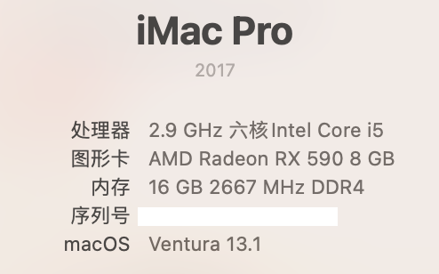
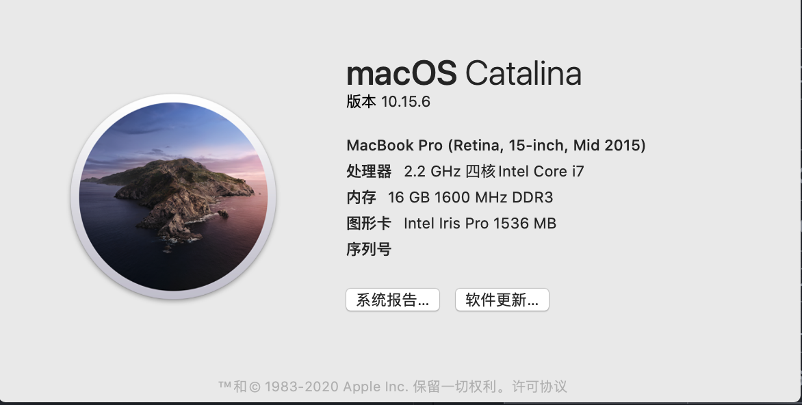

# Hackintosh OpenCore EFI
  

## Kexts

  | AppleALC | IntelMausi | Lilu  | NVMeFix | VirtualSMC | WhateverGreen |
  | :------: | :--------: | :---: | :-----: | :--------: | :-----------: |
  | 1.6.7    | 1.0.7      | 1.5.8 | 1.0.9   | 1.2.8      | 1.5.5         |

## Version History
🌟 *Monterey*

| EFI   | macOS   | OpenCore |    -       | 
| ----- | ------- | :------: | :--------: |
| 2.1   | 12.1    | 0.7.6    | 2021.12.14 |
| 2.0.1 | 12.0.1  | 0.7.5    | 2021.11.02 |
  
  

<i>Big Sur</i>

  | EFI   | macOS   | OpenCore |    -       | 
  | ----- | ------- | :------: | :--------: |
  | 1.9.1 | 11.6.1  | 0.7.4    | 2021.10.27 |
  | 1.9   | 11.6    | 0.7.3    | 2021.09.15 |
  | 1.8   | 11.5.2  | 0.7.2    | 2021.08.14 |
  | 1.7   | 11.5.1  | 0.7.1    | 2021.07.22 |
  | 1.6   | 11.4    | 0.6.9    | 2021.05.25 |
  | 1.5   | 11.3.1  | 0.6.8    | 2021.05.01 |
  | 1.4   | 11.2.3  | 0.6.7    | 2021.03.10 |
  | 1.3   | 11.2.2  | 0.6.6    | 2021.02.10 |
  | 1.2   | 11.1    | 0.6.4    | 2020.12.17 |
  | 1.1   | 11.0.1  | 0.6.3    | 2020.11.06 |

<i>Catalina</i>

  | EFI   | macOS   | OpenCore |    -       | 
  | ----- | ------- | :------: | :--------: |
  | 1.0   | 10.15.7 | 0.6.0    | 2020.07.23 |

## Working

- [x] Audio
- [x] Graphics / Hardware Acceleration ( H.264 & HEVC )
- [x] WiFi & Bluetooth, USB
- [x] Shutdown & Restart, Sleep & Wake
- [x] Sleep & Wake
- [x] AirDrop, SharePlay, Handoff
- [x] App Store, FaceTime, iMessage 

## Hardware & Peripherals

|                     |                                                       |
|  :--------------    | :---------------------------------------------------- |
| Motherboard         | MSI B360M MORTAR                                      |
| CPU                 | Intel Core i5-9400F                                   |
| Graphics            | Sapphire Radeon RX 590 NITRO+ SE                      |
| SSD                 | HIKVISION C2000 PRO 512GB                             |
| RAM                 | Apacer PANTHER 16GB(2x8GB) DDR4 2666Mhz C16           | 
| Power               | Super Flower HX550W 80 Plus Gold                      |
| WiFi & Bluetooth    | Fenvi FV-T919 BCM94360CD                              |
| Display             | AOC U2790PQU                                          |
| Webcam & Microphone | Logitech C920 PRO                                     |
| Mouse               | Logitech G PRO WIRELESS                               |
| Keyboard            | Magic Keyboard                                        |

## Benchmark

- Devices

| macOS 10.15.6                                                                         | CPU                  | Graphics |
| :-----------------------------------------------------------------------------------: | :------------------: | :--------------------------------------------------: |
|  Hackintosh                                | Intel Core i5-9400F  | AMD Radeon RX 590 |
|  MacBook Pro (Retina, 15-inch, Mid 2015) | Intel Core i7-4770HQ | Intel Iris Pro    |
|  MacBook Pro (16-inch, 2019)             | Intel Core i7-9750H  | ① AMD Radeon Pro 5300M   ② Intel UHD Graphocs 630 |

- Results

| Geekbench 5.2.0                         | Single-Core | Multi-Core | OpenCL         | Metal        | 
| :-------------------------------------: | --------: | ---------: | -------------------: | -----------------: |
| Hackintosh                              | 1025      | 5118       | 38203                | 39163              |
| MacBook Pro (Retina, 15-inch, Mid 2015) | 821       | 3303       | 5152                 | 520                |
| MacBook Pro (16-inch, 2019)             | 1073      | 5425       | ① 25241   ② 5186 | ① 23814   ② 4718 |

## Note

- [**OC Auxiliary Tools**](https://github.com/ic005k/QtOpenCoreConfig) can help you update **config.plist** 

- Refer [**here**](https://github.com/GeQ1an/MSI-B360M-MORTAR-HACKINTOSH-OPENCORE-EFI#%E4%BD%BF%E7%94%A8-efi) to help you adjust **BIOS Settings**

## References
- [*MSI-B360M-MORTAR-IMACPRO-EFI*](https://github.com/andot/MSI-B360M-MORTAR-IMACPRO-EFI)
- [*MSI-B360M-MORTAR-HACKINTOSH-OPENCORE-EFI*](https://github.com/GeQ1an/MSI-B360M-MORTAR-HACKINTOSH-OPENCORE-EFI)
