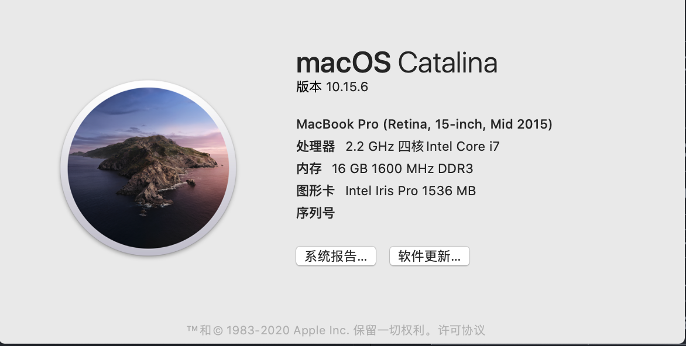
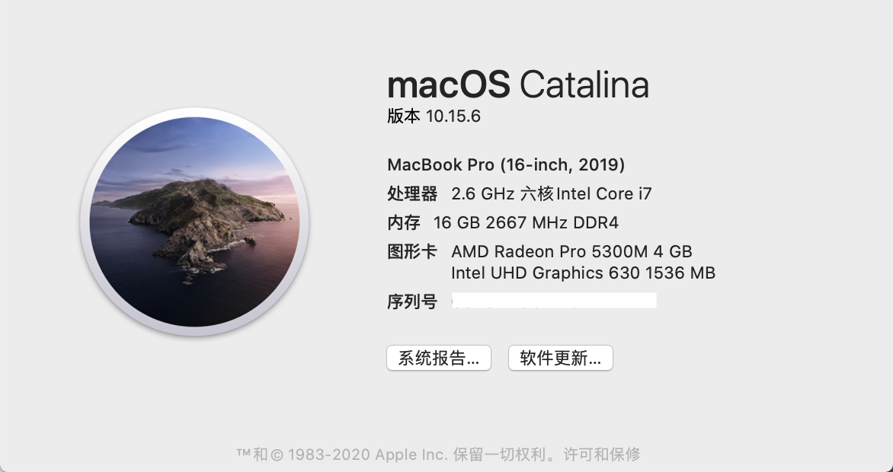

# OpenCore EFI

- 系统支持
  
  *macOS Big Sur 11.5.2*
  
- OpenCore
  
  *0.7.2*
  
- 内核扩展

  | 名称 | 版本 |
  | :-: | :-: |
  | AppleALC | 1.6.3 |
  | IntelMausi | 1.0.7 |
  | Lilu | 1.5.5 |
  | NVMeFix | 1.0.9 |
  | VirtualSMC | 1.2.6 |
  | WhateverGreen | 1.5.2 |

- 更新记录

  | 版本 | 日期 |
  | :-: | :-: |
  | 1.8 | 2021.08.14 |
  | 1.7 | 2021.07.22 |
  | 1.6 | 2021.05.25 |
  | 1.5 | 2021.05.01 |
  | 1.4 | 2021.03.10 |
  | 1.3 | 2021.02.10 |
  | 1.2 | 2020.12.17 |
  | 1.1 | 2020.11.06 |
  | 1.0 | 2020.07.23 |

**注意**
- 三码应重新设置
- 机型应根据配置设置
- BIOS 应根据使用情况设置
  
[*参考地址*](https://github.com/GeQ1an/MSI-B360M-MORTAR-HACKINTOSH-OPENCORE-EFI#%E4%BD%BF%E7%94%A8-efi)

# 功能

- [x] 声卡
- [x] 显卡 / 硬解 4K（HEVC + H.264）
- [x] WiFi & 蓝牙
- [x] 隔空投送 / 接力
- [x] 睡眠 / 键盘、鼠标唤醒
- [x] 原生电源管理

# 配置

| 主要硬件 | 品牌型号 |
| ---- | ---- |
| 主板  | 微星 B360M 迫击炮 |
| CPU  | Intel Core i5-9400F |
| 显卡  | 蓝宝石 RX590（8G D5 超白金 极光特别版） |
| SSD  | 海康威视 C2000 PRO（512G） |
| 内存  | 宇瞻 黑豹系列（8G DDR4 2666）x 2 |
| 电源  | 振华 80PLUS金牌战斗版（550w） |
| WiFi & 蓝牙  | 奋威 BCM94360CD（双频 1750M + 蓝牙 4.0）PCI-E 无线网卡 |

#  性能对比
- 系统：macOS Catalina 10.15.6
- 工具：Geekbench 5.2.0

- 设备：
  - 黑苹果
  

  - MacBook Pro (Retina, 15-inch, Mid 2015) 
    
  
  - MacBook Pro (16-inch, 2019)  
     

- 结果
  
  | 设备 | CPU | 单核 | 多核 |
  | - | -| - | - |
  | 黑苹果 | Intel Core i5-9400F |1025 | 5118 |
  | MacBook Pro (Retina, 15-inch, Mid 2015) |Intel Core i7-4770HQ | 821 | 3303 |
  | MacBook Pro (16-inch, 2019) | Intel Core i7-9750H | 1073 | 5425 |

  | 设备 | 显卡 | OpenCL | Metal |
  | - | - | - | - |
  | 黑苹果 | AMD Radeon RX 590 |38203 | 39163 |
  | MacBook Pro (Retina, 15-inch, Mid 2015) | Intel Iris Pro | 5152 | 520 |
  | MacBook Pro (16-inch, 2019) | AMD Radeon Pro 5300M   Intel UHD Graphocs 630  | 25241   5186 | 23814   4718 |

# 参考
[*MSI-B360M-MORTAR-IMACPRO-EFI*](https://github.com/andot/MSI-B360M-MORTAR-IMACPRO-EFI)

[*MSI-B360M-MORTAR-HACKINTOSH-OPENCORE-EFI*](https://github.com/GeQ1an/MSI-B360M-MORTAR-HACKINTOSH-OPENCORE-EFI)
