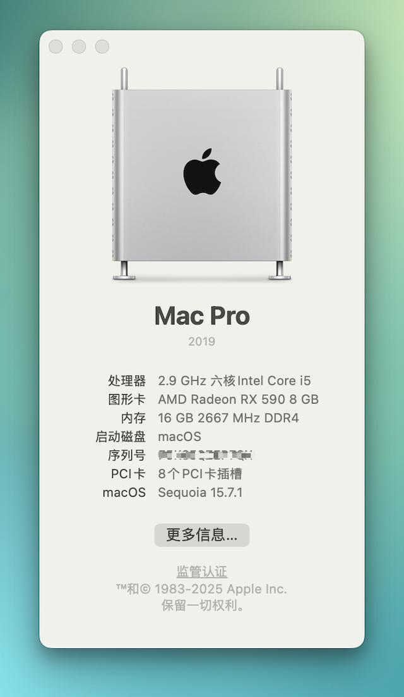

<!---  Update the following   -->

[os_img]: https://img.shields.io/badge/macOS-15.6-6D67E4
[os_link]: https://support.apple.com/en-hk/122716

[oc_img]: https://img.shields.io/badge/OpenCore-1.0.5-519872
[oc_link]: https://github.com/acidanthera/OpenCorePkg/releases/tag/1.0.5

[oclp_img]: https://img.shields.io/badge/OpenCore_Legacy_Patcher-2.4.0-blue
[oclp_link]: https://github.com/dortania/OpenCore-Legacy-Patcher/releases/tag/2.4.0

[bs_img]: https://img.shields.io/badge/BIOS-7B23v1D-yellow
[bs_link]: https://www.msi.com/Motherboard/B360M-MORTAR/support

[dc_img]: https://img.shields.io/badge/docs-%E4%B8%AD%E6%96%87-red
[dc_link]: https://zzzm.github.io/2020/07/24/hackintosh/

[ls_img]: https://img.shields.io/github/license/ZzzM/Hackintosh-MSI-B360M-MORTAR
[ls_link]: https://raw.githubusercontent.com/ZzzM/Hackintosh-MSI-B360M-MORTAR/master/LICENSE

<!---  Features  -->
<!--- 5.4: 1️⃣ Change iMacPro1,1 to MacPro7,1, 2️⃣ Change ACPI -->
<!--- 5.1: 1️⃣ Update config.plist, 2️⃣ Add RestrictEvents -->
<!--- 5.0: Upgrade BIOS from 7B23v1A to version 7B23v1D -->
<!--- 4.6.1: Use stable version of Kexts -->
# MSI B360M MORTAR & i5-9400F Hackintosh

[![os_img]][os_link]
[![oc_img]][oc_link]
[![oclp_img]][oclp_link]
[![bs_img]][bs_link]
[![dc_img]][dc_link]
[![ls_img]][ls_link]

## EFI for macOS Sequoia

| Version  |  Date      | Compatibility     | OC & OCLP      | Changes         |
| :------: | :--------: | ----------------- | :------------: | --------------- |
| 5.4      | 2025-07-30 | 15.5 ~ 15.6       | 1.0.5 & 2.4.0  | Change SMBIOS from **iMacPro1,1** to **MacPro7,1**                |
| 5.3      | 2025-04-01 | 15.4 ~ 15.4.1     | 1.0.4 & 2.3.0  |                 |
| 5.2      | 2024-12-12 | 15.2 ~ 15.3.2     | 1.0.3 & 2.2.0  |                 |
| 5.1      | 2024-10-30 | 15.1              | 1.0.2 & 2.0.2  |                 |
| 5.0      | 2024-09-17 | 15.0              | 1.0.1 & 2.0.1  |                 |

## Kexts

<table>
    <tr>
      <td>AppleALC</td>
      <td>1.9.5</td>
    </tr>
    <tr>
      <td>IntelMausiEthernet</td>
      <td>1.0.8</td>
    </tr>
    <tr>
      <td>Lilu</td>
      <td>1.7.1</td>
    </tr>
    <tr>
      <td>NVMeFix</td>
      <td>1.1.3</td>
    </tr>
    <tr>
      <td>USBInjectAll</td>
      <td>0.8.1</td>
    </tr>
    <tr>
      <td>VirtualSMC</td>
      <td>1.3.7</td>
    </tr>
    <tr>
      <td>WhateverGreen</td>
      <td>1.7.0</td>
    </tr>
</table>

**Patches**

<table>
    <tr>
      <td><a href='https://github.com/dortania/OpenCore-Legacy-Patcher/blob/main/payloads/Kexts/Wifi/IO80211FamilyLegacy-v1.0.0.zip'>IO80211FamilyLegacy</a></td>
      <td>1.0</td>
    </tr>
    <tr>
      <td><a href='https://github.com/dortania/OpenCore-Legacy-Patcher/blob/main/payloads/Kexts/Wifi/IOSkywalkFamily-v1.2.0.zip'>IOSkywalkFamily</a></td>
      <td>1.2</td>
    </tr>
    <tr>
      <td><a href='https://github.com/dortania/OpenCore-Legacy-Patcher/blob/main/payloads/Kexts/Acidanthera/AMFIPass-v1.4.1-RELEASE.zip'>AMFIPass</a></td>
      <td>1.4.1</td>
    </tr>
    <tr>
      <td>RestrictEvents</td>
      <td>1.1.6</td>
    </tr>
</table>

## Release History

<b> Sonoma </b>

| Version   | Date       | Compatibility  | OC & OCLP         |
| --------- | :--------: | -------------- | :---------------: | 
| 4.6.1     | 2024-08-08 | 14.6.1         |  1.0.1 & 1.5.0    | 
| 4.6       | 2024-07-31 | 14.6           |  1.0.0 & 1.5.0    |
| 4.5       | 2024-05-17 | 14.5           |  1.0.0 & 1.4.3    | 
| 4.4       | 2024-04-09 | 14.4 ~ 14.4.1  |  0.9.9 & 1.4.3    | 
| 4.3       | 2024-02-28 | 14.3 ~ 14.3.1  |  0.9.8 & 1.3.0    | 
| 4.2.1     | 2024-01-24 | 14.2.1 ~ 14.3  |  0.9.7 & 1.3.0    | 

<b> Ventura </b>

| Version   | Date       | Compatibility     | OpenCore |
| --------- | :--------: | ----------------- | :------: | 
| 3.6.3     | 2023-12-14 | 13.6.3            |  0.9.7   | 
| 3.6       | 2023-10-28 | 13.6 ~ 13.6.1     |  0.9.5   | 
| 3.5.1     | 2023-08-08 | 13.5 ~ 13.6       |  0.9.4   | 
| 3.5       | 2023-07-25 | 13.5              |  0.9.3   | 
| 3.4       | 2023-05-19 | 13.4 ~ 13.4.1 (c) |  0.9.2   | 
| 3.3       | 2023-03-28 | 13.3 ~ 13.3.1 (a) |  0.9.0   | 
| 3.2       | 2023-01-26 | 13.2 ~ 13.2.1     |  0.8.8   | 
| 3.1       | 2022-12-14 | 13.1              |  0.8.7   | 
| 3.0.1     | 2022-11-10 | 13.0.1            |  0.8.6   | 
| 3.0       | 2022-10-28 | 13.0              |  0.8.5   | 

<b> Monterey </b>

| Version   | Date       | Compatibility | OpenCore |  
| --------- | :--------: | ------------- | :------: |
| 2.6       | 2022-09-13 | 12.6 ~ 12.6.1 |  0.8.4   | 
| 2.5       | 2022-08-05 | 12.5 ~ 12.5.1 |  0.8.3   | 
| 2.4       | 2022-05-17 | 12.4          |  0.8.0   | 
| 2.3       | 2022-03-15 | 12.3 ~ 12.3.1 |  0.7.9   | 
| 2.2.1     | 2022-02-14 | 12.2.1        |  0.7.8   | 
| 2.2       | 2022-01-28 | 12.2          |  0.7.7   | 
| 2.1       | 2021-12-14 | 12.1          |  0.7.6   |
| 2.0.1     | 2021-11-02 | 12.0.1        |  0.7.5   | 

<b> Big Sur </b>

| Version   | Date       | Compatibility  | OpenCore | 
| --------- | :--------: | -------------- | :------: | 
| 1.9.1     | 2021-10-27 | 11.6.1         |  0.7.4   | 
| 1.9       | 2021-09-15 | 11.6           |  0.7.3   | 
| 1.8       | 2021-08-14 | 11.5.2         |  0.7.2   | 
| 1.7       | 2021-07-22 | 11.5.1         |  0.7.1   | 
| 1.6       | 2021-05-25 | 11.4           |  0.6.9   | 
| 1.5       | 2021-05-01 | 11.3.1         |  0.6.8   | 
| 1.4       | 2021-03-10 | 11.2.3         |  0.6.7   | 
| 1.3       | 2021-02-10 | 11.2.2         |  0.6.6   | 
| 1.2       | 2020-12-17 | 11.1           |  0.6.4   | 
| 1.1       | 2020-11-06 | 11.0.1         |  0.6.3   | 

<b> Catalina </b>

| Version | Date       | Compatibility   | OpenCore |
| ------- | :--------: | --------------- | :------: |
| 1.0     | 2020-07-23 | 10.15.7         |  0.6.0   |

## Working

- [x] Audio
- [x] Graphics / Hardware Acceleration ( H.264 & HEVC )
- [x] WiFi & Bluetooth, USB
- [x] Shutdown & Restart, Sleep & Wake
- [x] Sleep & Wake
- [x] AirDrop, SharePlay, Handoff
- [x] App Store, FaceTime, iMessage 

## Hardware & Peripherals

<table>
    <tr>
      <td>Motherboard</td>
      <td>MSI B360M MORTAR</td>
    </tr>
    <tr>
      <td>CPU</td>
      <td>Intel Core i5-9400F</td>
    </tr>
    <tr>
      <td>Graphics</td>
      <td>Sapphire Radeon RX 590 NITRO+ SE</td>
    </tr>
     <tr>
      <td>SSD</td>
      <td>HIKVISION C2000 PRO 512GB</td>
    </tr>
    <tr>
      <td>RAM</td>
      <td>Apacer PANTHER 16GB(2x8GB) DDR4 2666Mhz C16</td>
    </tr>
     <tr>
      <td>Power</td>
      <td>Super Flower HX550W 80 Plus Gold</td>
    </tr>
     <tr>
      <td>WiFi & Bluetooth	</td>
      <td>Fenvi FV-T919 BCM94360CD</td>
    </tr>
    <tr>
      <td>Monitor</td>
      <td>Xiaomi RMMNT27NU</td>
    </tr>
    <tr>
      <td>Webcam & Microphone</td>
      <td>Logitech C920 PRO</td>
    </tr>
    <tr>
      <td>Mouse</td>
      <td>Logitech G PRO WIRELESS</td>
    </tr>
    <tr>
      <td>Trackpad</td>
      <td>Apple Magic Trackpad</td>
    </tr>
    <tr>
      <td>Keyboard</td>
      <td>Apple Magic Keyboard </td>
    </tr>
</table>

## Recommended

- [BIOS Settings](https://github.com/GeQ1an/MSI-B360M-MORTAR-HACKINTOSH-OPENCORE-EFI/blob/master/README.en.md#bios-settings)
- [OpenCore Auxiliary Tools ](https://github.com/ic005k/QtOpenCoreConfig)

## Credits
- [andot](https://github.com/andot/MSI-B360M-MORTAR-IMACPRO-EFI)
- [GeQ1an](https://github.com/GeQ1an/MSI-B360M-MORTAR-HACKINTOSH-OPENCORE-EFI)
- [黑果小兵](https://blog.daliansky.net/)
- [Hackintool](https://github.com/benbaker76/Hackintool)
- [OpenCore](https://github.com/acidanthera/OpenCorePkg)
- [OpenCore Auxiliary Tools ](https://github.com/ic005k/QtOpenCoreConfig)
- [OpenCore Legacy Patcher](https://github.com/dortania/OpenCore-Legacy-Patcher)
